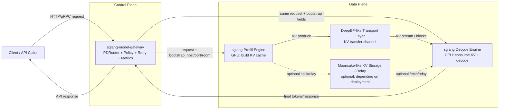
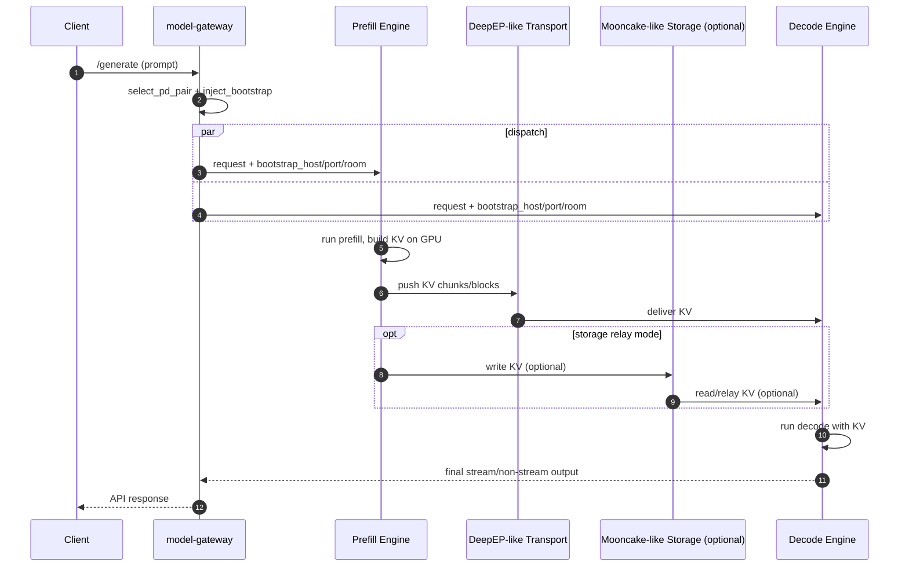

# PD 架构术语与疑问知识手册

这份手册专门解决“名词听过，但容易误解”的问题，帮助你把 PD 分离架构里的术语、动机和代码实现对齐。

适合在阅读以下代码时配合使用：

- `src/routers/http/pd_router.rs`
- `src/routers/grpc/pd_router.rs`
- `src/policies/`
- `src/core/worker_registry.rs`

---

## 1) `bootstrap` 到底是什么意思？

### Q: PD 里的 `bootstrap_host/bootstrap_port/bootstrap_room` 是干什么的？

**A:** 它们是给 Prefill 和 Decode 建立“KV Cache 交接通道”的连接信息，不是业务字段。

- `bootstrap_host`: Prefill 侧可被 Decode 访问的地址
- `bootstrap_port`: Prefill 暴露给 Decode 的 KV 传输端口
- `bootstrap_room`: 本次请求的会话房间号（用于隔离并发请求）

在 gateway 里由 `inject_bootstrap_into_value(...)` 注入到请求体，然后同一请求体并发发给 prefill 和 decode。

### Q: 这和统计学里的 bootstrap（自助法）有关系吗？

**A:** 没有直接关系。这里只是同名词，不同领域含义。

- **统计学 bootstrap**：重采样估计分布/置信区间
- **系统工程 bootstrap**：用最小启动信息把系统连接起来

PD 里的 bootstrap 属于后者：给 decode 足够信息去“引导连接” prefill 的 KV 传输通道。

### Q: 为什么命名成 bootstrap？

**A:** 因为 decode 在开始生成前需要“起步信息”（host/port/room）才能接上 prefill 的中间结果。  
这个过程本质上是“初始化协同上下文”，所以用 bootstrap 很自然。

---

## 2) PD 请求是不是被“发了两次”？

### Q: 看到 `tokio::join!(prefill.send(), decode.send())`，是不是重复请求？

**A:** 是“并发双发”，但语义上不是重复业务请求，而是 PD 协同的两段执行。

- 发给 prefill：负责算 prompt 并产出 KV
- 发给 decode：负责消费 KV 并生成最终输出

二者是同一用户请求在分离架构下的两个执行角色。

---

## 3) 为什么最终响应主要看 decode，而不是 prefill？

### Q: prefill 也返回了结果，为什么客户端看的是 decode 结果？

**A:** 在 PD 模式里 decode 是“最终生成出口”，prefill 更像“上游准备阶段”。

- decode 失败通常直接影响对外响应
- prefill 失败会导致 decode 后续不可用，因此网关会尽早失败/重试
- 某些场景下 prefill 的附加信息（如 logprob）会被合并到最终响应

---

## 4) `policy`、`retry`、`health` 到底谁负责什么？

### Q: 是策略负责容错吗？

**A:** 不完全。它们分工如下：

- `policy`: 决定“选谁”（选择器）
- `health/circuit`: 决定“谁可选”（可用性过滤）
- `retry`: 决定“失败后怎么办”（恢复机制）

可以记成：**先筛可用，再做选择，失败后重试。**

---

## 5) `is_healthy` 和 `is_available` 有什么区别？

### Q: 为什么代码里不只看健康状态？

**A:** `is_available` 通常比 `is_healthy` 更严格，可能包含熔断状态等约束。

- `is_healthy`: 健康检查层面的活性信号
- `is_available`: 路由层可分配信号（健康 + 熔断 + 其他策略门控）

调度时通常看 `is_available`，避免把请求打到“虽然活着但应暂时隔离”的节点。

---

## 6) PD 的核心是“单节点调度”还是“配对调度”？

### Q: 为什么说 PD 调度更难？

**A:** Regular 模式只选一个 worker；PD 需要同时选 prefill + decode 两边，属于 pair scheduling（配对调度）。

这会带来额外复杂度：

- 两边都要可用
- 两边的负载与故障状态都要考虑
- 两边之间还要有 KV 协同链路

---

## 7) HTTP 和 gRPC 的 PD 是两套逻辑吗？

### Q: 两者是否完全不同？

**A:** 传输协议不同，但核心思想一致。

共同点：

- 选 prefill/decode
- 建立协同上下文
- 分发并处理返回
- 失败重试和错误映射

差异点：

- 数据封装（JSON vs Protobuf）
- 错误语义（HTTP status vs gRPC status）
- 某些字段注入与序列化路径不同

---

## 8) 常见“名字像、含义不同”的术语对照

| 术语 | 在本项目中的含义 | 常见误解 |
|------|------------------|----------|
| `bootstrap` | prefill/decode 协同启动信息 | 误解成统计学 bootstrap |
| `room` | 一次请求的 KV 通道隔离 ID | 误解成业务聊天室 |
| `policy` | 选 worker 的策略 | 误解成重试/限流总开关 |
| `retry` | 失败恢复机制 | 误解成调度策略本身 |
| `healthy` | 健康检查通过 | 误解成一定可被路由 |
| `available` | 当前可被分配请求 | 误解成仅等于健康 |

---

## 9) 调试时的“最小确认清单”

当你怀疑 PD 路由没按预期工作时，按这个顺序确认：

1. 命中 `RouterFactory::create_pd_router`（确认路由类型）
2. 命中 `select_pd_pair`（确认选中的 pair）
3. 看到 `inject_bootstrap_into_value` 注入三元组
4. 看到 `tokio::join!` 并发双发
5. 在两侧 worker handler 都命中

这 5 步都成立，基本可以确认 PD 主链路正确。

---

## 10) 一句话心智模型

PD 路由不是“把同一请求随机发两份”，而是：  
**用策略选出一对协同节点，借助 bootstrap 建立 KV 交接上下文，让 prefill 和 decode 各司其职地完成同一条请求。**

---

## 11) 图解：KV Cache 交接中的参与方与边界

> 说明：下图是“概念架构图”。其中 `Mooncake`、`DeepEP` 代表可能的存储/通信实现形态，实际部署可以替换为等价组件。  
> 核心原则不变：**gateway 做控制编排，推理引擎做 KV 生产与消费。**

### 11.1 组件关系图（Control Plane vs Data Plane）

### 11.2 各方职责（你最关心的能力边界）

| 参与方 | 主要职责 | 不负责什么 |
|---|---|---|
| `sglang-model-gateway` | 选 prefill/decode、注入 bootstrap、并发双发、重试、观测 | 不直接读写 GPU KV，不做 decode 算子执行 |
| `sglang Prefill Engine` | 运行 prefill 前向、生成 KV | 不负责最终对外响应聚合 |
| `sglang Decode Engine` | 接入 KV 并执行逐 token decode，产出最终结果 | 不负责全局路由决策 |
| `DeepEP-like 通信层` | 提供高效 KV 传输通道 | 不负责业务路由策略 |
| `Mooncake-like 存储层` | 可选的 KV 中转/持久化/分发能力（按部署） | 不负责模型推理逻辑 |

---

## 12) 图解：一次 PD 请求的时序（含 KV 交接）

### 12.1 关键结论（面试/评审可直接复述）

- `bootstrap_*` 是“协同启动参数”，不是模型特征或统计学概念。
- Gateway 处在控制平面，只编排不计算；KV 真正生效在推理引擎内。
- KV 交接可走“直连通信层”或“经中转存储”的不同部署形态。
- PD 的核心复杂度来自“配对调度 + 协同链路”，而非单点路由。

