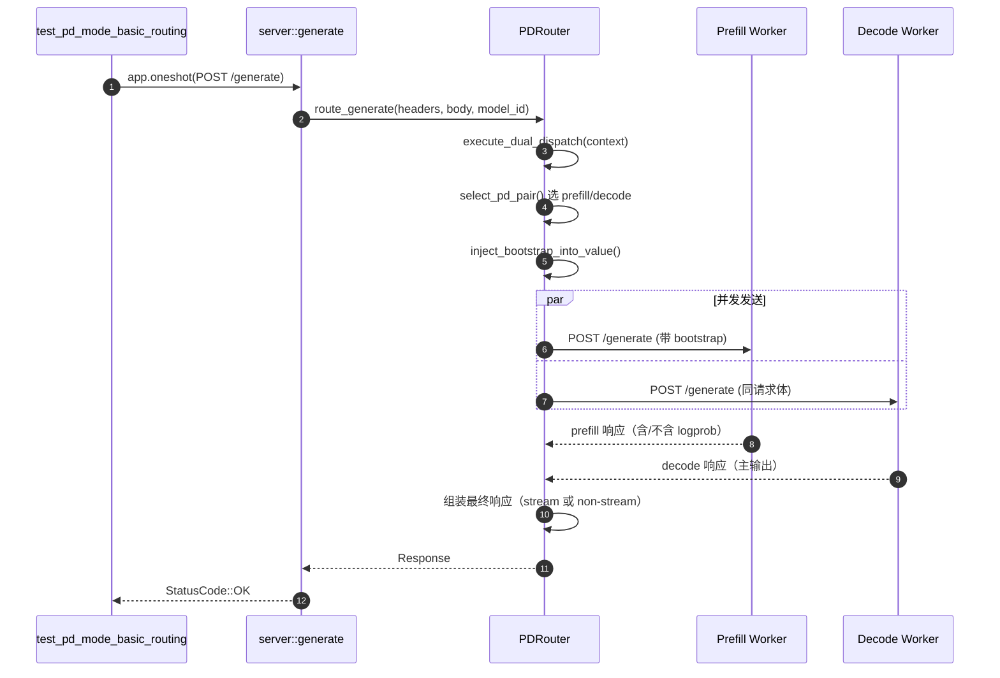

# PD 路由调用链逐行学习手册（基于 `test_pd_mode_basic_routing`）

这份文档面向“看得见断点，但看不懂代码流程”的场景。  
目标是让你在 RustRover 里跟着断点单步时，能明确知道：

- 当前函数为什么会被调用
- 关键变量分别代表什么
- 下一步应该跳到哪里看
- 怎么判断“真的走到了 model-gateway 的真实路由逻辑”

---

## 1. 先建立一个总地图（你当前这条链路）

`test_pd_mode_basic_routing` 的实际执行链路如下：

1. `tests/routing/pd_routing_test.rs`  
   `test_pd_mode_basic_routing`
2. `tests/common/mod.rs`  
   `AppTestContext::new_with_config`
3. `src/routers/factory.rs`  
   `RouterFactory::create_router` -> `create_pd_router`
4. `tests/common/test_app.rs` + `src/server.rs`  
   `build_app` 注册 `/generate` 路由，`app.oneshot(req)` 进入 handler
5. `src/server.rs`  
   `generate(...)` -> `state.router.route_generate(...)`
6. `src/routers/http/pd_router.rs`  
   `PDRouter::route_generate`
7. `src/routers/http/pd_router.rs`  
   `PDRouter::execute_dual_dispatch`
8. `src/routers/http/pd_router.rs`  
   `PDRouter::select_pd_pair`（挑 prefill/decode）
9. `src/routers/http/pd_router.rs`  
   `PDRouter::execute_dual_dispatch_internal`（并发双发）
10. `tests/common/mock_worker.rs`  
    `generate_handler`（mock worker 收到请求）

只要你能在 6/8/9/10 这几个点连贯命中，就可以确认是“真实 router 逻辑”。

---

## 2. 测试入口逐行理解

文件：`tests/routing/pd_routing_test.rs`  
函数：`test_pd_mode_basic_routing`

### 2.1 配置阶段

- `RouterConfig::builder().prefill_decode_mode(...)`
  - 第一组 URL 是 prefill workers（19800/19801）
  - 第二组 URL 是 decode workers（19802/19803）
- `.power_of_two_policy(1)`
  - 指定策略配置（会影响后面的 worker 选择）

你在这里需要理解的核心：  
**测试并不是伪造“选中的结果”，它只提供配置，真正选谁在 router 内部完成。**

### 2.2 上下文阶段

- `AppTestContext::new_with_config(config, workers).await`
  - 启动 4 个 `MockWorker` 实例
  - 初始化 `AppContext` / `WorkerRegistry` / `PolicyRegistry`
  - 通过 `RouterFactory::create_router` 创建真实 router（PD 模式）

### 2.3 请求阶段

- `let app = ctx.create_app().await;`
- 循环发 `POST /generate`
- `app.clone().oneshot(req).await`

注意：`oneshot` 不走真实 TCP 监听，但会走完整 Axum 路由栈和 `RouterTrait` 实现。

---

## 3. Router 是怎么被“选成 PD”的

文件：`src/routers/factory.rs`

### 3.1 `create_router(ctx)` 的判断

- 先看 `connection_mode`（HTTP / gRPC）
- 再看 `RoutingMode`（Regular / PrefillDecode / OpenAI）
- 在 HTTP + PrefillDecode 下会走 `create_pd_router(...)`

### 3.2 `create_pd_router(...)` 做了什么

- 创建 prefill policy / decode policy
- 写入 `ctx.policy_registry`
- `PDRouter::new(ctx)` 构造 PD router 实例

调试建议：  
如果你怀疑进了 regular router，就在这里打断点，看是否命中 `create_pd_router`。

---

## 4. `/generate` 入口 handler 在做什么

文件：`src/server.rs`  
函数：`generate(...)`

逻辑非常直接：

- 解析 body 为 `GenerateRequest`
- 取 `model_id = body.model.as_deref()`
- 调 `state.router.route_generate(Some(&headers), &body, model_id)`

这里的关键是：  
`state.router` 是 trait object，但实际动态类型是 `PDRouter`（由前面 factory 决定）。

---

## 5. `PDRouter::route_generate` 逐行理解

文件：`src/routers/http/pd_router.rs`  
函数：`route_generate(...)`

### 5.1 读取请求上下文

- `is_stream = body.stream`
- `return_logprob = body.return_logprob.unwrap_or(false)`
- `request_text`（仅当策略需要文本时提取）
- `batch_size = get_generate_batch_size(body)`

### 5.2 组装 `PDRequestContext`

这个结构体把后续分发要用的信息打包起来：

- `route`（这里是 `"/generate"`）
- 是否流式、是否要 logprob
- 可选文本、model_id、headers
- batch_size（影响 bootstrap 字段是否是数组）

### 5.3 进入核心

- `self.execute_dual_dispatch(headers, body, context).await`

这一行之后就进入 PD 核心链路。

---

## 6. `execute_dual_dispatch`：重试外壳 + 选 worker + 注入 bootstrap

文件：`src/routers/http/pd_router.rs`  
函数：`execute_dual_dispatch(...)`

你可以把它看成“总控”。

### 6.1 请求级统计

- 记录 router request metrics
- `route_to_endpoint(route)` 归一化 endpoint 名称

### 6.2 进入重试执行器

- `RetryExecutor::execute_response_with_retry(...)`
- 每次 attempt 内部会执行同一套步骤

### 6.3 每次 attempt 的关键三步

1. `select_pd_pair(...)`：挑 prefill + decode
2. `inject_bootstrap_into_value(...)`：把 prefill 的 bootstrap 信息写回 JSON
3. `execute_dual_dispatch_internal(...)`：真正并发发送给两边 worker

### 6.4 状态回写

- 根据返回状态给 `prefill.record_outcome(...)` / `decode.record_outcome(...)`
- 决定是否需要重试（通常看 5xx/可重试状态）

调试时如果你只想看“核心行为”，优先盯住：

- `select_pd_pair` 的返回值（选了谁）
- `json_request` 注入后的内容
- `execute_dual_dispatch_internal` 的入参

---

## 7. `select_pd_pair`：策略选择逐行理解

文件：`src/routers/http/pd_router.rs`  
函数：`select_pd_pair(...)`

### 7.1 先拿候选集合

- `prefill_workers = worker_registry.get_prefill_workers()`（或按 model 过滤）
- `decode_workers = worker_registry.get_decode_workers()`（或按 model 过滤）

### 7.2 拿策略对象

- `prefill_policy = policy_registry.get_prefill_policy()`
- `decode_policy = policy_registry.get_decode_policy()`

### 7.3 调策略挑 index

内部用 `pick_worker_by_policy_arc(...)`：

- 先过滤 `is_available()`（健康 + 熔断可用）
- 调 `policy.select_worker(...)` 返回下标
- `available_workers[selected_idx].clone()`

### 7.4 返回选中对

- `Ok((prefill, decode))`

你在断点里重点看：

- `prefill_workers.len()` / `decode_workers.len()`
- `available_workers` 是否为空
- `policy.name()`
- 最终 `prefill.url()` 与 `decode.url()`

---

## 8. `inject_bootstrap_into_value`：PD 协调信息注入

文件：`src/routers/http/pd_router.rs`  
函数：`inject_bootstrap_into_value(...)`

这个函数把请求体从“普通 generate 请求”改造成“PD 可协同请求”。

写入三个关键字段：

- `bootstrap_host`
- `bootstrap_port`
- `bootstrap_room`

含义：

- host/port 告诉 decode 去哪里等 prefill 侧 KV 传输
- room 用于隔离同批不同请求的 KV 通道

如果是 batch，会写数组版本；单请求写标量版本。

---

## 9. 你当前断点函数：`execute_dual_dispatch_internal` 逐行版

文件：`src/routers/http/pd_router.rs`  
函数：`execute_dual_dispatch_internal(...)`

下面按逻辑块拆开看：

### 9.1 负载 guard（你截图停在这里）

- 非流式：立刻创建 `_prefill_guard` / `_decode_guard`
- 流式：guard 会在 `create_streaming_response` 中附着到响应 body

作用：  
RAII 方式统计 worker 负载，函数退出或响应 body 结束时自动释放。

### 9.2 trace 头处理

- `headers_with_trace = headers.cloned().unwrap_or_default()`
- `inject_trace_context_http(&mut headers_with_trace)`

作用：把追踪上下文传给下游 worker。

### 9.3 构建两条 POST 请求

- `prefill_request = build_post_with_headers(... prefill.url() ...)`
- `decode_request = build_post_with_headers(... decode.url() ...)`

注意：两边 route 都是同一个 `context.route`（此处是 `/generate`），但请求体已带 bootstrap 信息。

### 9.4 并发发送（PD 核心）

- `tokio::join!(prefill_request.send(), decode_request.send())`

这行就是“双发”发生的位置。

### 9.5 先处理 decode 结果

- decode 非 2xx：走 `handle_decode_error_response(...)`
- decode 成功：继续处理 prefill 结果

### 9.6 再处理 prefill 结果

- `process_prefill_response(...)`
- prefill 失败会尽快返回错误（避免 decode 空等 KV）

### 9.7 最终响应组装

- stream：`create_streaming_response(...)`
- non-stream：直接透传 decode body，或做 logprob 合并

---

## 10. mock worker 侧如何验证请求确实到了

文件：`tests/common/mock_worker.rs`  
函数：`generate_handler(...)`

### 10.1 你能直接看到的证据

- handler 被命中（断点触发）
- `config.port` 显示当前 worker 端口
- 返回头里含 `x-worker-id = worker-<port>`

### 10.2 结合 gateway 侧一起看

在 gateway 侧 `select_pd_pair` 看到：

- prefill = `19800/19801` 之一
- decode = `19802/19803` 之一

在 mock worker 侧 `generate_handler` 也分别命中这些端口，说明双发成立。

---

## 11. 为什么变量窗口里会出现 `could not find item`

这是 Rust async 调试常见现象，常见原因：

- 变量在 closure/await 边界被 move
- 编译器优化导致符号不可见
- 断点停在变量尚未 materialize 的位置

不是逻辑没执行。可用下面方法缓解：

- 保持 `[profile.dev] debug = 2`
- 在“变量刚赋值后”再下断点
- 同一函数多打几个近邻断点（例如 `select_pd_pair` 返回后、`join!` 前后）

---

## 12. 推荐调试顺序（照着点就能看懂）

按下面顺序打断点并单步：

1. `RouterFactory::create_pd_router`
2. `server::generate`
3. `PDRouter::route_generate`
4. `PDRouter::execute_dual_dispatch`
5. `PDRouter::select_pd_pair`
6. `PDRouter::inject_bootstrap_into_value`
7. `PDRouter::execute_dual_dispatch_internal`（重点看 `tokio::join!`）
8. `mock_worker::generate_handler`

每次停下都只问三个问题：

- 我现在是在“选路由/选worker/发请求/处理返回”哪一阶段？
- 当前关键变量是什么（route / selected workers / json_request / status）？
- 下一跳应该到哪一层？

---

## 13. 一句话记忆版

`test_pd_mode_basic_routing` 的本质是：  
**通过真实 `PDRouter`，先选一对 prefill/decode，再把带 bootstrap 的同一请求并发发给两边，最后把 decode 结果返回给调用方。**

你已经打到 `execute_dual_dispatch_internal`，说明已经进入核心分发内圈。

---

## 14. 时序图版（一次 `/generate` 请求）

下面这张图建议你配合断点一起看。  
你可以把一条请求理解成：**控制面在 Gateway，计算面在 Prefill/Decode。**

### 14.1 时序上的关键理解

- `select_pd_pair` 和 `inject_bootstrap_into_value` 发生在并发发送之前。
- `prefill` 与 `decode` 是同一轮 attempt 内并发发起（`tokio::join!`）。
- 最终对客户端的响应主体以 `decode` 结果为主；`prefill` 更多承担 KV 预热/协同职责。
- 如果 decode 失败，会先按 decode 错误分支返回；如果 prefill 失败，也会在 prefill 处理阶段尽快失败（避免 decode 空等）。

### 14.2 与断点一一对应（按时序）

1. `server::generate`  
   你会看到请求刚进网关。
2. `PDRouter::route_generate`  
   你会看到请求被识别为 PD 处理路径。
3. `PDRouter::execute_dual_dispatch`  
   你会看到进入 retry attempt 外层。
4. `PDRouter::select_pd_pair`  
   你会看到本次请求最终选中的 prefill/decode URL。
5. `PDRouter::inject_bootstrap_into_value`  
   你会看到 bootstrap 字段被写入请求体。
6. `PDRouter::execute_dual_dispatch_internal`  
   你会看到 `tokio::join!(...)` 并发双发。
7. `mock_worker::generate_handler`  
   你会在 prefill/decode 两侧分别观察到请求命中。

---

## 15. 单次请求“实战观察清单”（照抄即可）

当你单步一条请求时，只记录下面 8 个值，就能把整个过程串起来：

1. `route`（应为 `/generate`）
2. `policy.name()`（prefill/decode）
3. `prefill.url()`
4. `decode.url()`
5. 注入后的 `bootstrap_host`
6. 注入后的 `bootstrap_port`
7. 注入后的 `bootstrap_room`
8. 最终 `response.status()`

你可以把这 8 个值记在注释或笔记里，连续看 3~5 次请求，就会非常清楚：

- 策略是否在生效（选点有没有变化）
- 请求是否确实双发到两边
- 返回是否稳定来自 decode 主链路

---

## 16. 常见“看起来怪但其实正常”的现象

- 只在一个 worker 断点停住：  
  可能是你当前只在某个端口实例下了断点，另一个端口没断点。
- `tokio::join!` 后变量不好看：  
  async + closure 的调试符号不总稳定，属于 Rust 调试常态。
- 非流式请求里 guard 很快消失：  
  因为 body 读取完后作用域结束，RAII guard 正常释放。

这三类现象都不代表路由逻辑错误。

